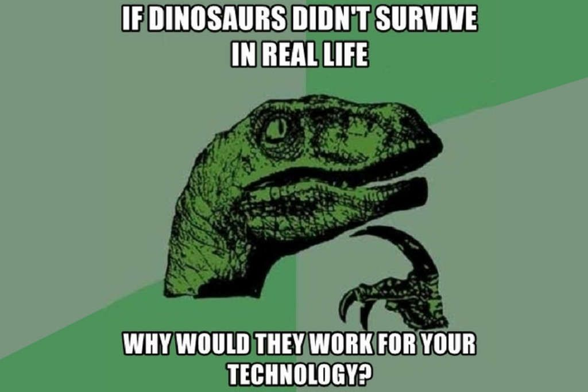
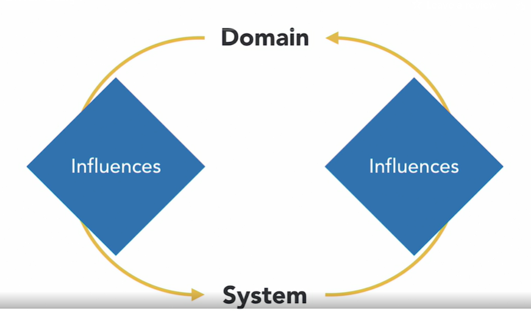

# DDD (Domain Driven Design)

- Authored by Eric Evans, to solve the problem of the dinosaours back to earth
- Developed before agile and microservices exists
- The overall design is ideal and is still applicable today.

## Characteristics

- Collaborative (Agile term)
  - Business people and developers must work together daily throughout the project => Agile Manifesto
  - So the philosophy behind the scene is identical with (Agile)
- Modeling
  - Structure of the code models one-to-one to the structure of Domain (Something like (Code first Your models in EF Core))
  - So You Model the business as code
  - So any change in the business reflect that into your code
  - The domain is the processor of design
  - The change come from your domain (say Electricity) and, you must get the equivelant process for your code 
  - ONE-TO-ONE mapping is the principle you need to solve the problem (One Domain Story = One Code Plugin)
  - When change come to domai, you know where to look at your code
- Incremental (Agile Term)
  - Incremental mean don't go throw design a big architecture before you code.
  - You come just with architecture to solve the problem that's right front of you.

## Not Only Domin Influnces your system

- So the domain is your processor to write your code
- But in real world, that after you deploy your System
- The System influnces your client
- So The client have feedback to make Change requests
- So It iterate back to the Domin
- Cyclic Process ??

## Agile inspect and adapt 
1. Make a small change 
2. Release it
3. Assess feedback
4. inspect and adapt
5. improve

> So how to model the domain ?? (Story)

## Story

> Descripes the end user performing a domain-driven, result oriented task.

- A short narrative
- Make it a couple of sentences
- Descripes your users at work

How to code that ???

## Microservices
- The common way DDD is implementeds
